# Diagramme des cas d'utilisation

```mermaid
flowchart TB
    %% Acteurs
    admin((Admin))
    user((Utilisateur))
    
    %% Cas d'utilisation Authentification
    auth[S'authentifier]
    
    %% Cas d'utilisation Administrateur
    admin_shortcuts[Gérer les raccourcis]
    admin_pdfs[Gérer les PDFs]
    admin_users[Gérer les utilisateurs]
    
    %% Sous-cas d'utilisation Raccourcis Admin
    create_shortcut[Créer un raccourci]
    edit_shortcut[Modifier un raccourci]
    delete_shortcut[Supprimer un raccourci]
    
    %% Sous-cas d'utilisation PDFs Admin
    upload_pdf[Uploader un PDF]
    delete_pdf[Supprimer un PDF]
    
    %% Sous-cas d'utilisation Utilisateurs Admin
    create_user[Créer un utilisateur]
    assign_user[Assigner des ressources<br>à un utilisateur]
    
    %% Cas d'utilisation Utilisateur
    view_shortcuts[Consulter les raccourcis]
    view_pdfs[Consulter les PDFs]
    use_shortcut[Utiliser un raccourci]
    download_pdf[Télécharger un PDF]
    
    %% Relations Authentification
    admin --> auth
    user --> auth
    
    %% Relations Admin
    admin --> admin_shortcuts
    admin --> admin_pdfs
    admin --> admin_users
    
    %% Relations Sous-cas Admin Raccourcis
    admin_shortcuts --> create_shortcut
    admin_shortcuts --> edit_shortcut
    admin_shortcuts --> delete_shortcut
    
    %% Relations Sous-cas Admin PDFs
    admin_pdfs --> upload_pdf
    admin_pdfs --> delete_pdf
    
    %% Relations Sous-cas Admin Utilisateurs
    admin_users --> create_user
    admin_users --> assign_user
    
    %% Relations Utilisateur
    user --> view_shortcuts
    user --> view_pdfs
    view_shortcuts --> use_shortcut
    view_pdfs --> download_pdf

    %% Styling
    classDef actor fill:#f9f,stroke:#333,stroke-width:2px
    classDef useCase fill:#bbf,stroke:#333,stroke-width:1px
    classDef subCase fill:#ddf,stroke:#333,stroke-width:1px
    
    class admin,user actor
    class auth,admin_shortcuts,admin_pdfs,admin_users,view_shortcuts,view_pdfs useCase
    class create_shortcut,edit_shortcut,delete_shortcut,upload_pdf,delete_pdf,create_user,assign_user,use_shortcut,download_pdf subCase
```

## Description

Ce diagramme illustre les différents cas d'utilisation de l'application de gestion de raccourcis et de PDFs. Il montre :

1. **Deux types d'acteurs** :
   - Admin (Administrateur)
   - Utilisateur (Personne B)

2. **Fonctionnalités administrateur** :
   - Gestion des raccourcis (création, modification, suppression)
   - Gestion des PDFs (upload, suppression)
   - Gestion des utilisateurs (création, assignation des ressources)

3. **Fonctionnalités utilisateur** :
   - Consultation des raccourcis
   - Utilisation des raccourcis
   - Consultation des PDFs
   - Téléchargement des PDFs

4. **Fonctionnalité commune** :
   - Authentification